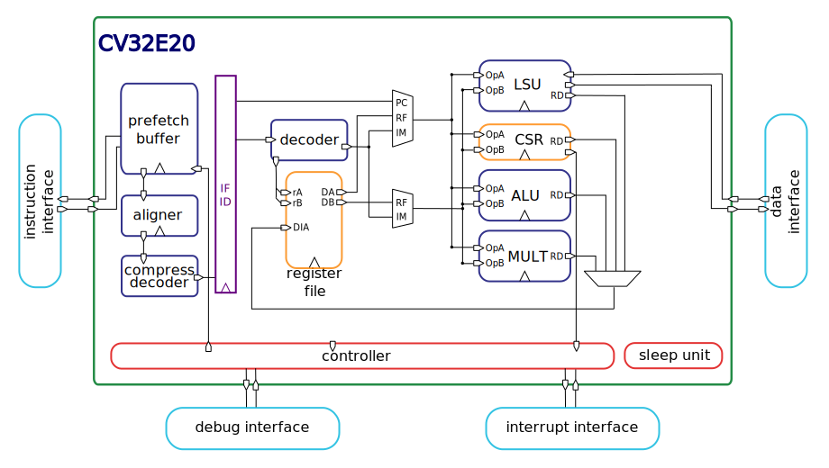

=====================
CV32E20 Specification
=====================

Revision 0.1

License
=======

Copyright 2022-2023 OpenHW Group

Copyright 2018-2022 lowRISC Revision 8d044a3d

Copyright 2017-2018, ETH Zurich and University of Bologna

Copyright 2018 ETH Zürich and University of Bologna

SPDX-License-Identifier: Apache-2.0 WITH SHL-2.1

Licensed under the Solderpad Hardware License v 2.1 (the “License”); you
may not use this file except in compliance with the License, or, at your
option, the Apache License version 2.0. You may obtain a copy of the
License at https://solderpad.org/licenses/SHL-2.1/.

Unless required by applicable law or agreed to in writing, any work
distributed under the License is distributed on an “AS IS” BASIS,
WITHOUT WARRANTIES OR CONDITIONS OF ANY KIND, either express or implied.
See the License for the specific language governing permissions and
limitations under the License.

Introduction
============

The OpenHW Group CV32E20, or simply E20, is a RISC-V processor core that
is targeted for the ultra-low-end of the 32-bit microcontroller (MCU)
application space. Likely uses include any “constrained compute socket”
or as the processor element in embedded SoC subsystems.

The core design was originally developed as the PULPino *ZeroRISCY*
processor by ETH Zürich and the University of Bologna and later enhanced
by the lowRISC consortium as the *Ibex* core. For this project, the Ibex
design description is copied and further enhanced by the OpenHW Group.
The design is qualified using the industrial-strength
Core-V-Verification methodologies. The source RTL code is written in
SystemVerilog and maintained by the OpenHW Group.

This specification is organized as requirements that apply to the “Scope
of the IP”. The Revision 0.1 of this requirements document is intended
to specify the “Version 1” E20 design – there are already plans for
subsequent enhancements that will be included in a Version 2 (and
possibly beyond) design releases. Subsequent revision numbers are
placeholders for these enhancements after the initial project freeze
(PF) gate.

The requirement list is to be approved by the OpenHW Group Technical
Work Group (TWG), as well as any subsequent change requests.

The specification is complemented by a user’s guide.

*A list of abbreviations is available at the end of this document.*

This development is co-sponsored by NXP and Intrinsix, a wholly owned
subsidiary of CEVA.

Scope
=====

Scope of the IP
---------------

The **scope of the IP** is the processor core subsystem that is
specified below and that is verified with a 100% coverage goal. In the
verification plans, the scope of the IP can be partitioned into two DUTs
(designs under test) - one covering the processor core itself, and a
“\ **coreplex**\ ” covering the processor “core complex” which adds
debug capabilities, an interrupt controller and system bus protocol
wrappers to the E20 core.

The scope of the IP is the **CV32E20 hardware** supporting all the
features used in products based on the E20 core. A high-level block
diagram of the E20 core is shown below:

As displayed in this core block diagram, the E20 is a 2-stage pipelined
implementation featuring a 32-bit Harvard memory architecture for
independent instruction fetch and data load/store interfaces. The first
pipeline stage is the instruction fetch (IF), while the second stage is
the Instruction Decode and Execute (ID/EX).

As displayed in the above figure, the IP comprises:

-  The CV32E20 processor core with dual 32-bit Harvard memory interfaces

   -  Instruction fetch bus, data load/store bus

   -  Support for both RV32I (32 x 32b GPRs) and RV32E (16 x 32b GPRs)

   -  Support for ISA extensions: C (compressed) and M (multiply &
      divide)

   -  Support for basic set of Configuration & Status Registers (CSRs)

-  Dual 32-bit Harvard memory interfaces

   -  Supported core protocol is OBI_1_v1.2 (Open Bus Interface)
      definition

At the coreplex design level, the following functions are added to the
processor core:

-  Debug module including the DTM

-  Interrupt module

-  System bus wrappers to convert from OBI to the AMBA-AHB (Advanced
   Microcontroller Bus Architecture, Advanced High-performance Bus)
   protocol

In addition to these main configurations, multiple fine grain parameters
are available.

Unless otherwise stated, optional features are controlled by
SystemVerilog parameters. If not selected, each optional feature is not
present in the netlist after synthesis. The reader’s attention is drawn
to the difference between an optional feature (“...\ *shall* support as
an option...”) versus a desired goal (“...\ *should* support...”,
“...\ *should* reduce latency...”).

The following topics are beyond the scope of this specification:

-  Software (SW layers), such as compilers, assemblers and OSes
   (although these could be part of the OpenHW Group CV32E20 project)

-  Software emulation of RISC-V optional extensions (feasible but the
   scope of the IP is the core and coreplex hardware)

-  Other features included in the testbench (main memory, firmware,
   interconnect…), the coverage of which are not measured

Golden configurations
---------------------

It is not possible to verify all 2\ :sup:`n` combinations of design
parameters. Below is the list of golden configurations that will undergo
verification in the project and their main parameters. The full list of
parameters for each golden configuration are detailed in the user guide.

+----------------------------+-----------------+----------------------+
| Configuration              | Target          | RV32{E,I} ISA        |
+----------------------------+-----------------+----------------------+
| cv32e2_emc_fpga            | FPGA            | RV32EMC              |
+----------------------------+-----------------+----------------------+
| cv32e2_imc_fpga            | FPGA            | RV32IMC              |
+----------------------------+-----------------+----------------------+
| cv32e2_emc_asic            | ASIC            | RV32EMC              |
+----------------------------+-----------------+----------------------+
| cv32e2_imc_asic            | ASIC            | RV32IMC              |
+----------------------------+-----------------+----------------------+

References
==========

Applicable specifications
-------------------------

To ease the reading, the reference to these specifications is implicit
in the requirements below. For the sake of precision, the requirements
identify the versions of RISC-V extensions from these specifications.

[RVuser] “The RISC-V Instruction Set Manual, Volume I: Unprivileged ISA,
Document Version 20191213”, Editors Andrew Waterman and Krste Asanović,
RISC-V Foundation, December 13, 2019.

[RVpriv] “The RISC-V Instruction Set Manual, Volume II: Privileged
Architecture, Document Version 20211203”, Editors Andrew Waterman and
Krste Asanović, RISC-V Foundation, December 4, 2021.

[RVdbg-RATIFIED] “RISC-V External Debug Support, Document Version
0.13.2”, Editors Tim Newsome and Megan Wachs, RISC-V Foundation, March
22, 2019.

[RVdbg-STABLE] “RISC-V External Debug Support, Document Version
1.0.0-STABLE”, Editors Ernie Edgar and Tim Newsome, RISC-V Foundation,
April 7, 2022.

[OPENHW-OBI] OpenHW Open Bus Interface (OBI) protocol, version 1.4,
*https://github.com/openhwgroup/core-v-docs/blob/master/cores/obi/OBI-v1.4.pdf*

[AMBA] “AMBA® AHB Protocol Specification”, ARM IHI 0033C (ID090921),
https://developer.arm.com/documentation/ihi0033/latest.

[RVsmclic] “Smclic” Core-Local Interrupt Controller (CLIC) RISC-V
Privileged Architecture Extension, version 0.9-draft, 3/15/2022,
*https://github.com/riscv/riscv-fast-interrupt/blob/master/clic.pdf.*

Other documents
===============

[FPGAreset] Ken Chapman, “Get Smart About Reset: Think Local, Not
Global”, Xilinx WP272 white paper,
*https://docs.xilinx.com/v/u/en-US/wp272*.

CV32E20 core functional requirements
====================================

General requirement
-------------------

+--------+--------------------------------------------------------------+
| GEN-10 | CV32E20 shall be **fully compliant with RISC-V               |
|        | specifications** by implementing all mandatory features for  |
|        | the selected extensions.                                     |
+--------+--------------------------------------------------------------+

As the RISC-V specification leaves ample space for options, this section
specifies these options.

RISC-V standard instructions
----------------------------

To ease tracing for verification, the extensions are split into
independent requirements.

+--------+---------------------------------------------------------------+
| ISA-10 | CV32E20 shall support **RV32I** base instruction set, version |
|        | 2.1 (ratified).                                               |
+--------+---------------------------------------------------------------+
| ISA-20 | CV32E20 shall support **RV32E** base instruction set, version |
|        | 1.9 (draft).                                                  |
+--------+---------------------------------------------------------------+
| ISA-30 | CV32E20 shall support the **M** extension (integer multiply & |
|        | divide), version 2.0 (ratified).                              |
+--------+---------------------------------------------------------------+
| ISA-40 | CV32E20 shall support the **C** extension (compressed         |
|        | instructions), version 2.0 (ratified).                        |
+--------+---------------------------------------------------------------+
| ISA-50 | CV32E20 shall support the **Zicsr** extension (CSR            |
|        | instructions), version 2.0 (ratified).                        |
+--------+---------------------------------------------------------------+
| ISA-60 | CV32E20 shall support the **Zifencei** extension, version 2.0 |
|        | (ratified).                                                   |
+--------+---------------------------------------------------------------+

Operating modes (Privilege Levels)
----------------------------------

+--------+--------------------------------------------------------------+
| PVL-10 | CV32E20 shall support only little-endian memory              |
|        | organizations.                                               |
+--------+--------------------------------------------------------------+
| PVL-20 | CV32E20 shall support **machine** and **unprivileged**       |
|        | privilege modes.                                             |
+--------+--------------------------------------------------------------+
| PVL-30 | CV32E20 shall export the CPU’s operating mode as an address  |
|        | phase attribute output signals on the Harvard memory         |
|        | interfaces (instruction fetch, data load/store) with machine |
|        | mode defined as 1’b1 and user mode as 1’b0.                  |
+--------+--------------------------------------------------------------+
| PVL-40 | CV32E20 shall support the **bare** (addressing) mode, that   |
|        | is, no support for address translation or protection.        |
+--------+--------------------------------------------------------------+

Control and Status Registers (CSRs)
-----------------------------------

+--------+--------------------------------------------------------------+
| CSR-10 | CV32E20 shall implement all mandatory CSRs of Debug, Machine |
|        | and User modes as per specifications in [RVpriv].            |
+--------+--------------------------------------------------------------+

In keeping with the CV32E20’s smallest size and power core targets, the
implemented set of CSRs is intentionally minimized.

The implemented set of CSRs includes the following registers:

+--------+--------------------------------------------------------------+
| CSR-20 | CV32E20 shall implement these mandatory Machine Mode CSRs as |
|        | per specifications in [RVpriv]. Optional registers are       |
|        | *highlighted*. The registers are listed based on ascending   |
|        | CSR number.                                                  |
|        |                                                              |
|        | CSR Number CSR Register Description                          |
|        |                                                              |
|        | 0x300 mstatus // machine status                              |
|        |                                                              |
|        | 0x301 misa // machine isa and extensions                     |
|        |                                                              |
|        | 0x304 mie // machine interrupt enable register               |
|        |                                                              |
|        | 0x305 mtvec // machine trap vector base address              |
|        |                                                              |
|        | 0x320 mcountinhibit // HPM-10: machine counter inhibit       |
|        | register                                                     |
|        |                                                              |
|        | *0x323 mhpmevent3 // HPM-20: perf monitor event selector*    |
|        |                                                              |
|        | *0x324 mhpmevent4 // HPM-20: perf monitor event selector*    |
|        |                                                              |
|        | *0x325 mhpmevent5 // HPM-20: perf monitor event selector*    |
|        |                                                              |
|        | *0x326 mhpmevent6 // HPM-20: perf monitor event selector*    |
|        |                                                              |
|        | *0x327 mhpmevent7 // HPM-20: perf monitor event selector*    |
|        |                                                              |
|        | *0x328 mhpmevent8 // HPM-20: perf monitor event selector*    |
|        |                                                              |
|        | *0x329 mhpmevent9 // HPM-20: perf monitor event selector*    |
|        |                                                              |
|        | *0x32a mhpmevent10 // HPM-20: perf monitor event selector*   |
|        |                                                              |
|        | *0x32b mhpmevent11 // HPM-20: perf monitor event selector*   |
|        |                                                              |
|        | *0x32c mhpmevent12 // HPM-20: perf monitor event selector*   |
|        |                                                              |
|        | 0x340 mscratch // machine scratch register                   |
|        |                                                              |
|        | 0x341 mepc // machine exception program counter              |
|        |                                                              |
|        | 0x342 mcause // machine cause register                       |
|        |                                                              |
|        | 0x343 mtval // machine trap value register                   |
|        |                                                              |
|        | 0x344 mip // machine interrupt pending register              |
|        |                                                              |
|        | 0x7a0 tselect // trigger select register                     |
|        |                                                              |
|        | 0x7a1 tdata1 // trigger data register 1                      |
|        |                                                              |
|        | 0x7a2 tdata2 // trigger data register 2                      |
|        |                                                              |
|        | 0x7a3 tdata3 // trigger data register 3                      |
|        |                                                              |
|        | 0x7a8 mcontext // machine context register                   |
|        |                                                              |
|        | 0x7aa scontext // supervisor context register                |
|        |                                                              |
|        | 0x7b0 dcsr // debug control and status register              |
|        |                                                              |
|        | 0x7b1 dpc // debug pc register                               |
|        |                                                              |
|        | 0x7b2 dscratch0 // debug scratch register 0                  |
|        |                                                              |
|        | 0x7b3 dscratch1 // debug scratch register 2                  |
|        |                                                              |
|        | 0x7c0 cpuctrl // cpu control register                        |
|        |                                                              |
|        | 0xb00 mcycle // HPM-10: machine cycle counter                |
|        |                                                              |
|        | 0xb02 minstret // HPM-10: machine insts retired counter      |
|        |                                                              |
|        | *0xb03 mpmcounter3 // HPM-10: number of load/store cycles*   |
|        |                                                              |
|        | *0xb04 mpmcounter4 // HPM-10: number of inst fetch cycles*   |
|        |                                                              |
|        | *0xb05 mpmcounter5 // HPM-10: number of load cycles*         |
|        |                                                              |
|        | *0xb06 mpmcounter6 // HPM-10: number of store cycles*        |
|        |                                                              |
|        | *0xb07 mpmcounter7 // HPM-10: number of jump cycles*         |
|        |                                                              |
|        | *0xb08 mpmcounter8 // HPM-10: number of conditional br       |
|        | cycles*                                                      |
|        |                                                              |
|        | *0xb09 mpmcounter9 // HPM-10: number of cond br taken        |
|        | cycles*                                                      |
|        |                                                              |
|        | *0xb0a mpmcounter10 // HPM-10: number of return inst cycles* |
|        |                                                              |
|        | *0xb0b mpmcounter11 // HPM-10: number of wfi cycles*         |
|        |                                                              |
|        | *0xb0c mpmcounter12 // HPM-10: number of divide cycles*      |
|        |                                                              |
|        | 0xb80 mcycleh // HPM-10: upper word of mcycle                |
|        |                                                              |
|        | 0xb82 minstreth // HPM-10: upper word of minstret            |
|        |                                                              |
|        | *0xb83 mpmcounter3h // HPM-20: upper word of mpmcounter3*    |
|        |                                                              |
|        | *0xb84 mpmcounter4h // HPM-20: upper word of mpmcounter4*    |
|        |                                                              |
|        | *0xb85 mpmcounter5h // HPM-20: upper word of mpmcounter5*    |
|        |                                                              |
|        | *0xb86 mpmcounter6h // HPM-20: upper word of mpmcounter6*    |
|        |                                                              |
|        | *0xb87 mpmcounter7h // HPM-20: upper word of mpmcounter7*    |
|        |                                                              |
|        | *0xb88 mpmcounter8h // HPM-20: upper word of mpmcounter8*    |
|        |                                                              |
|        | *0xb89 mpmcounter9h // HPM-20: upper word of mpmcounter9*    |
|        |                                                              |
|        | *0xb8a mpmcounter10h // HPM-20: upper word of mpmcounter10*  |
|        |                                                              |
|        | *0xb8b mpmcounter11h // HPM-20: upper word of mpmcounter11*  |
|        |                                                              |
|        | *0xb8c mpmcounter12h // HPM-20: upper word of mpmcounter12*  |
|        |                                                              |
|        | 0xc00 cycle // unprivileged mode cycle, lower 32b            |
|        |                                                              |
|        | 0xc02 instret // unprivileged mode instret, lower 32b        |
|        |                                                              |
|        | 0xc80 cycleh // unprivileged mode cycle, upper 32b           |
|        |                                                              |
|        | 0xc82 instreth // unprivileged mode instret, upper 32b       |
|        |                                                              |
|        | 0xf11 mvendorid // machine vendor ID                         |
|        |                                                              |
|        | 0xf12 marchid // machine architecture ID                     |
|        |                                                              |
|        | 0xf13 mimpid // machine implementation ID                    |
|        |                                                              |
|        | 0xf14 mhartid // hardware thread ID                          |
+--------+--------------------------------------------------------------+

CSR hardware performance counters
---------------------------------

For the performance monitor counters, the default CSR configuration for
the CV32E20 core implements the two 64-bit cycle and
inst(ructions)ret(ired) counters along with the 32-bit mcountinhibit
register.

The 64-bit counters are accessed using CSRR instructions separately
reading the upper and lower 32-bit values. A 4-instruction loop can be
used to provide a fully coherent 64-bit register read that provides
protection against any “race condition” involving an overflow from the
lower order 32-bit register.

+--------+---------------------------------------------------------------+
| HPM-10 | CV32E20 shall implement the 64-bit mcycle and minstret        |
|        | standard performance counters (including their upper 32 bits  |
|        | counterparts mcycleh and minstreth) as per [RVpriv]:          |
|        |                                                               |
|        | CSR Number PM Counter Description                             |
|        |                                                               |
|        | 0x320 mcountinhibit // machine-mode                           |
|        |                                                               |
|        | 0xb00 mcycle // machine mode cycle, lower 32 bits             |
|        |                                                               |
|        | 0xb02 minstret // machine mode instret, lower 32 bits         |
|        |                                                               |
|        | 0xb80 mcycleh // machine mode cycle, upper 32 bits            |
|        |                                                               |
|        | 0xb82 minstreth // machine mode instret, upper 32 bits        |
|        |                                                               |
|        | 0xc00 cycle // unprivileged mode cycle, lower 32b             |
|        |                                                               |
|        | 0xc02 instret // unprivileged mode instret, lower 32b         |
|        |                                                               |
|        | 0xc80 cycleh // unprivileged mode cycle, upper 32b            |
|        |                                                               |
|        | 0xc82 instreth // unprivileged mode instret, upper 32b        |
+--------+---------------------------------------------------------------+
| HPM-20 | CV32E20 should support 10 optional event counters             |
|        | (mhpmcounterX{h}) and their associated event selector         |
|        | (mhpmeventX) performance monitoring registers. *The default   |
|        | width of these registers is 32 bits*.                         |
|        |                                                               |
|        | These registers are intended to provide hardware performance  |
|        | monitoring capabilities in FPGA development targets (and/or   |
|        | ASIC SoC targets).                                            |
|        |                                                               |
|        | **NOTE: The Ibex documentation is incorrect/confusing about   |
|        | the optional presence of mpmcounter{11,12}. This              |
|        | specification assumes the Ibex documentation is simply        |
|        | incorrect for these 2 counters.**                             |
|        |                                                               |
|        | CSR Number PM Counter Description                             |
|        |                                                               |
|        | 0xb03 mhpmcounter3 // m-mode performance-monitoring counter 3 |
|        |                                                               |
|        | // NumCyclesLSU, lower 32 bits                                |
|        |                                                               |
|        | 0xb04 mphmcounter4 // m-mode performance-monitoring counter 4 |
|        |                                                               |
|        | // NumCyclesIF, lower 32 bits                                 |
|        |                                                               |
|        | 0xb05 mphmcounter5 // m-mode performance-monitoring counter 5 |
|        |                                                               |
|        | // NumLoads, lower 32 bits                                    |
|        |                                                               |
|        | 0xb06 mphmcounter6 // m-mode performance-monitoring counter 6 |
|        |                                                               |
|        | // NumStores, lower 32 bits                                   |
|        |                                                               |
|        | 0xb07 mphmcounter7 // m-mode performance-monitoring counter 7 |
|        |                                                               |
|        | // NumJumps, lower 32 bits                                    |
|        |                                                               |
|        | 0xb08 mphmcounter8 // m-mode performance-monitoring counter 8 |
|        |                                                               |
|        | // NumBranches, lower 32 bits                                 |
|        |                                                               |
|        | 0xb09 mphmcounter9 // m-mode performance-monitoring counter 9 |
|        |                                                               |
|        | // NumBranchesTaken, lower 32 bits                            |
|        |                                                               |
|        | 0xb0a mphmcounter10 // m-mode performance-monitoring counter  |
|        | 10                                                            |
|        |                                                               |
|        | // NumInstrRetC, lower 32 bits                                |
|        |                                                               |
|        | 0xb0b mphmcounter11 // m-mode performance-monitoring counter  |
|        | 11                                                            |
|        |                                                               |
|        | // NumCyclesWFI, lower 32 bits                                |
|        |                                                               |
|        | 0xb0c mphmcounter12 // m-mode performance-monitoring counter  |
|        | 12                                                            |
|        |                                                               |
|        | // NumCyclesDivWait, lower 32 bits                            |
|        |                                                               |
|        | 0xb83 mhpmcounter3h // m-mode performance-monitoring counter  |
|        | 3                                                             |
|        |                                                               |
|        | // NumCyclesLSU, upper 32 bits                                |
|        |                                                               |
|        | 0xb84 mphmcounter4h // m-mode performance-monitoring counter  |
|        | 4                                                             |
|        |                                                               |
|        | // NumCyclesIF, upper 32 bits                                 |
|        |                                                               |
|        | 0xb85 mphmcounter5h // m-mode performance-monitoring counter  |
|        | 5                                                             |
|        |                                                               |
|        | // NumLoads, upper 32 bits                                    |
|        |                                                               |
|        | 0xb86 mphmcounter6h // m-mode performance-monitoring counter  |
|        | 6                                                             |
|        |                                                               |
|        | // NumStores, upper 32 bits                                   |
|        |                                                               |
|        | 0xb87 mphmcounter7h // m-mode performance-monitoring counter  |
|        | 7                                                             |
|        |                                                               |
|        | // NumJumps, upper 32 bits                                    |
|        |                                                               |
|        | 0xb88 mphmcounter8h // m-mode performance-monitoring counter  |
|        | 8                                                             |
|        |                                                               |
|        | // NumBranches, upper 32 bits                                 |
|        |                                                               |
|        | 0xb89 mphmcounter9h // m-mode performance-monitoring counter  |
|        | 9                                                             |
|        |                                                               |
|        | // NumBranchesTaken, upper 32 bits                            |
|        |                                                               |
|        | 0xb8a mphmcounter10h // m-mode performance-monitoring counter |
|        | 10                                                            |
|        |                                                               |
|        | // NumInstrRetC, upper 32 bits                                |
|        |                                                               |
|        | 0xb8b mphmcounter11h // m-mode performance-monitoring counter |
|        | 11                                                            |
|        |                                                               |
|        | // NumCyclesWFI, upper 32 bits                                |
|        |                                                               |
|        | 0xb8c mphmcounter12h // m-mode performance-monitoring counter |
|        | 12                                                            |
|        |                                                               |
|        | // NumCyclesDivWait, upper 32 bits                            |
|        |                                                               |
|        | The mphmeventX registers are the event selectors and          |
|        | enable/disable the corresponding mphmcounterX registers. The  |
|        | association of the events with the mphmcounterX registers are |
|        | hardwired.                                                    |
|        |                                                               |
|        | CSR Number Event Selector Description: event ID/bit, reset    |
|        | value                                                         |
|        |                                                               |
|        | 0x323 mhpmevent3 // 3, 0x0000_0008                            |
|        |                                                               |
|        | 0x324 mphmevent4 // 4, 0x0000_0010                            |
|        |                                                               |
|        | 0x325 mphmevent5 // 5, 0x0000_0020                            |
|        |                                                               |
|        | 0x326 mphmevent6 // 6, 0x0000_0040                            |
|        |                                                               |
|        | 0x327 mphmevent7 // 7, 0x0000_0080                            |
|        |                                                               |
|        | 0x328 mphmevent8 // 8, 0x0000_0100                            |
|        |                                                               |
|        | 0x329 mphmevent9 // 9, 0x0000_0200                            |
|        |                                                               |
|        | 0x32a mphmevent10 // 10, 0x0000_0400                          |
|        |                                                               |
|        | 0x32b mphmevent11 // 11, 0x0000_0800                          |
|        |                                                               |
|        | 0x32c mphmevent12 // 12, 0x0000_1000                          |
+--------+---------------------------------------------------------------+
| NOTE   | It should be mentioned that the event associated with         |
|        | mphm{event,counter}11 has a different definition for the E20  |
|        | core versus Ibex. This counter no longer tracks multiply      |
|        | cycles, but rather, the cycles when the core is quiescent in  |
|        | the ‘wait for interrupt’ state.                               |
+--------+---------------------------------------------------------------+

Additional details on the CSRs are available in the user manual.

Interface requirements
======================

CV32E20 core memory bus
-----------------------

+--------+-------------------------------------------------------------+
| MEM-10 | CV32E20 core shall support a Harvard memory interface with  |
|        | two 32-bit OBI interfaces, one for instruction fetch and a  |
|        | second for data loads & stores. Each bus includes a 32-bit  |
|        | byte address and dual 32-bit buses for read and write data. |
|        | Data references support 8-bit byte, 16-bit halfword and     |
|        | 32-bit word elements.                                       |
+--------+-------------------------------------------------------------+

CV32E20 coreplex memory bus
---------------------------

+--------+-------------------------------------------------------------+
| MEM-20 | The CV32E20 coreplex shall support a Harvard memory         |
|        | interface with two 32-bit AMBA-AHB5 interfaces, one for     |
|        | instruction fetch and a second for data loads & stores.     |
|        | Each bus includes a 32-bit byte address and dual 32-bit     |
|        | buses for read and write data. Data references support      |
|        | 8-bit byte, 16-bit halfword and 32-bit word elements.       |
+--------+-------------------------------------------------------------+
| MEM-21 | The CV32E20 coreplex also shall support a 32-bit AMBA-AHB5  |
|        | interface from the debug module to allow real-time debug    |
|        | access to system memory.                                    |
+--------+-------------------------------------------------------------+
| MEM-30 | The CV32E20 coreplex shall support unaligned (also known as |
|        | *misaligned*) data accesses for the E20 core by generating  |
|        | 2 bus cycles to complete the memory reference. This         |
|        | capability requires individual byte strobes be supported in |
|        | the attached data memory.                                   |
|        |                                                             |
|        | If this capability cannot be supported, the coreplex shall  |
|        | support an optional hardware configuration where all        |
|        | unaligned data accesses are decomposed into combinations of |
|        | 8- and 16-bit transfers. This means the ‘worst-case’ data   |
|        | unalignment may require 3 bus cycles (byte, halfword, byte) |
|        | to complete.                                                |
+--------+-------------------------------------------------------------+
| MEM-40 | The CV32E20 coreplex shall generate only SINGLE AHB         |
|        | transactions, that is, no BURST transactions are generated  |
|        | by the E20 core.                                            |
+--------+-------------------------------------------------------------+
| MEM-50 | The CV32E20 coreplex AHB5 bus protocol shall support the    |
|        | following design interface parameters:                      |
|        |                                                             |
|        | ADDR_WIDTH 32                                               |
|        |                                                             |
|        | DATA_WIDTH 32                                               |
|        |                                                             |
|        | HBURST_WIDTH 4                                              |
|        |                                                             |
|        | HPROT_WIDTH 4                                               |
|        |                                                             |
|        | HMASTER_WIDTH 0                                             |
+--------+-------------------------------------------------------------+
| MEM-60 | The CV32E20 coreplex AHB5 bus protocol shall not support    |
|        | signaling associated with exclusive accesses – this implies |
|        | the HEXCL and HEXOKAY control signals are not used.         |
+--------+-------------------------------------------------------------+
| MEM-70 | The CV32E20 coreplex AHB5 bus protocol shall encode the     |
|        | operating mode of every access using the {HNONSECURE,       |
|        | HPROT[1]} bus attribute signals defined as:                 |
|        |                                                             |
|        | if E20 core mode = user, then {HNONSECURE, HPROT[1]} =      |
|        | 2’b10                                                       |
|        |                                                             |
|        | if E20 core mode = supervisor, then {HNONSECURE, HPROT[1]}  |
|        | = 2’b11                                                     |
|        |                                                             |
|        | if E20 core mode = machine, then {HNONSECURE, HPROT[1]} =   |
|        | 2’b01                                                       |
+--------+-------------------------------------------------------------+
| MEM-80 | The CV32E20 coreplex AHB5 bus protocol shall implement a    |
|        | 4-bit HPROT[*] bus attribute control where HPROT[3:2] is    |
|        | hardwired to 2’b00.                                         |
+--------+-------------------------------------------------------------+

Debug
-----

+---------+------------------------------------------------------------+
| DBG-10  | CV32E20 shall implement the features outlined in Chapter 4 |
|         | of [RVdbg].                                                |
+---------+------------------------------------------------------------+

In addition, there can be an external debug module, not in the scope of
the IP.

Interrupts
----------

+---------+------------------------------------------------------------+
| IRQ-10  | CV32E20 shall implement interrupt handling registers as    |
|         | per the RISC-V privilege specification and interface with  |
|         | a CLIC implementation.                                     |
+---------+------------------------------------------------------------+

Coprocessor interface
---------------------

+--------+-------------------------------------------------------------+
| XIF-10 | For *subsequent* core implementations, CV32E20 shall        |
|        | support the coprocessor interface compliant with [CV-X-IF]  |
|        | to extend the supported instructions. The goal is a set of  |
|        | compatible interfaces between the CORE-V cores, for         |
|        | example, CV32E40{P,S,X}, CV32E20, …                         |
|        |                                                             |
|        | The initial version of CV32E20 shall not support the        |
|        | CV-X-IF coprocessor interface.                              |
+--------+-------------------------------------------------------------+

PPA targets
===========

These PPA targets will be updated when physical design monitoring is
integrated in the continuous integration flow.

+--------+-------------------------------------------------------------+
| PPA-10 | CV32E20 should be resource optimized for both ASIC and FPGA |
|        | targets.                                                    |
|        |                                                             |
|        | In general, the relative priority of the PPA metrics is     |
|        | Power > Area > Performance. The project needs to determine  |
|        | how much to measure and minimize power dissipation -        |
|        | core/coreplex area provides a general proxy for power with  |
|        | numerous caveats.                                           |
+--------+-------------------------------------------------------------+
| PPA-20 | CV32E20 should deliver more than x.y CoreMark/MHz           |
|        | performance when targeting RV32IMC for maximum performance, |
|        | for example, GCC -O3 compiler options and attached to zero  |
|        | wait-state instruction and data memories.                   |
|        |                                                             |
|        | This performance metric should be defined across multiple   |
|        | configuration variables like RV32{I,E}MC, compilers         |
|        | {GCC,LLVM} and compiler options {-O3, -Os/-Oz}. The core's  |
|        | operating environment is defined with attached zero         |
|        | wait-state instruction and data memories.                   |
+--------+-------------------------------------------------------------+
| PPA-30 | CV32E20 should operate at more than ? MHz in the            |
|        | CV32E20\_?\_fpga configuration on Kintex 7 FPGA technology. |
|        |                                                             |
|        | Metric details to be supplied later.                        |
+--------+-------------------------------------------------------------+
| PPA-50 | CV32E20 should operate at more than ? MHz in the            |
|        | CV32E20\_? configuration on 16-nm FFT technology in the     |
|        | worst-case frequency corner with the fastest threshold      |
|        | voltage.                                                    |
|        |                                                             |
|        | Metric details to be supplied later.                        |
+--------+-------------------------------------------------------------+

Physical design rules
---------------------

As different teams have different design rules and flows, and to ease
the integration in FPGA and ASIC design flows:

+---------+------------------------------------------------------------+
| PDR-10  | CV32E20 should have a configurable global reset signal:    |
|         | synchronous/asynchronous, active high/low.                 |
|         |                                                            |
|         | For asynchronous resets, the assertion edge is treated as  |
|         | an asynchronous event; the negation edge is treated as a   |
|         | *synchronous* event.                                       |
+---------+------------------------------------------------------------+
| PDR-20  | CV32E20 shall be a “super-synchronous” design with a       |
|         | single clock input and all sequential elements operating   |
|         | on the pos-edge of the clock.                              |
+---------+------------------------------------------------------------+
| PDR-40  | CV32E20 should not include multi-cycle paths.              |
+---------+------------------------------------------------------------+
| PDR-50  | CV32E20 should not include technology-dependent blocks.    |
|         |                                                            |
|         | If technology-dependent blocks are used, e.g., to improve  |
|         | PPA on certain targets, the equivalent                     |
|         | technology-independent block should be available. A design |
|         | parameter can be used to select between the                |
|         | implementations.                                           |
+---------+------------------------------------------------------------+
| PDR-20  | For certain FPGA targets, CV32E20 may remove the reset in  |
|         | the RTL code.                                              |
|         |                                                            |
|         | See [FPGAreset] for background information on this         |
|         | requirement.                                               |
+---------+------------------------------------------------------------+

List of abbreviations
=====================

+------+---------------------------------------------------------------+
| AHB  | Advanced High-performance Bus                                 |
+======+===============================================================+
| ALU  | Arithmetic/Logic Unit                                         |
+------+---------------------------------------------------------------+
| AMBA | Arm's Advanced Microcontroller Bus Architecture               |
+------+---------------------------------------------------------------+
| ASIC | Application-Specific Integrated Circuit                       |
+------+---------------------------------------------------------------+
| AXI  | Advanced eXtensible Interface                                 |
+------+---------------------------------------------------------------+
| CLIC | Core-Local Interrupt Controller                               |
+------+---------------------------------------------------------------+
| C    | SiFive Core-Local Interruptor                                 |
| LINT |                                                               |
+------+---------------------------------------------------------------+
| core | Core Complex                                                  |
| plex |                                                               |
+------+---------------------------------------------------------------+
| CSR  | Control and Status Register                                   |
+------+---------------------------------------------------------------+
| CV-  | Core-V Coprocessor (X) Interface                              |
| X-IF |                                                               |
+------+---------------------------------------------------------------+
| DTM  | Debug Transport Module                                        |
+------+---------------------------------------------------------------+
| DUT  | Device Under Test                                             |
+------+---------------------------------------------------------------+
| FPGA | Field Programmable Gate Array                                 |
+------+---------------------------------------------------------------+
| GP   | CPU General-Purpose Register(s)                               |
| R(s) |                                                               |
+------+---------------------------------------------------------------+
| I    | Pipeline stage: Instruction Decode & Execute                  |
| D/EX |                                                               |
+------+---------------------------------------------------------------+
| IF   | Pipeline stage: Instruction Fetch                             |
+------+---------------------------------------------------------------+
| IP   | Intellectual Property                                         |
+------+---------------------------------------------------------------+
| ISA  | Instruction Set Architecture                                  |
+------+---------------------------------------------------------------+
| LSU  | CPU Load/Store Unit                                           |
+------+---------------------------------------------------------------+
| MCU  | Microcontroller                                               |
+------+---------------------------------------------------------------+
| MHz  | Megahertz                                                     |
+------+---------------------------------------------------------------+
| MULT | CPU Multiplier                                                |
+------+---------------------------------------------------------------+
| OBI  | Open Bus Interface protocol                                   |
+------+---------------------------------------------------------------+
| OSes | Operating Systems                                             |
+------+---------------------------------------------------------------+
| PF   | Open Hardware Group Project Freeze                            |
+------+---------------------------------------------------------------+
| PLIC | Platform-Level Interrupt Controller                           |
+------+---------------------------------------------------------------+
| RI   | 5th generation of UC Berkeley reduced instruction set         |
| SC-V | computing,                                                    |
|      |                                                               |
|      | pronounced as "risk-five"                                     |
+------+---------------------------------------------------------------+
| RTL  | Register-Transfer Language                                    |
+------+---------------------------------------------------------------+
| SoC  | System on a Chip                                              |
+------+---------------------------------------------------------------+
| TWG  | Technical Working Group                                       |
+------+---------------------------------------------------------------+
